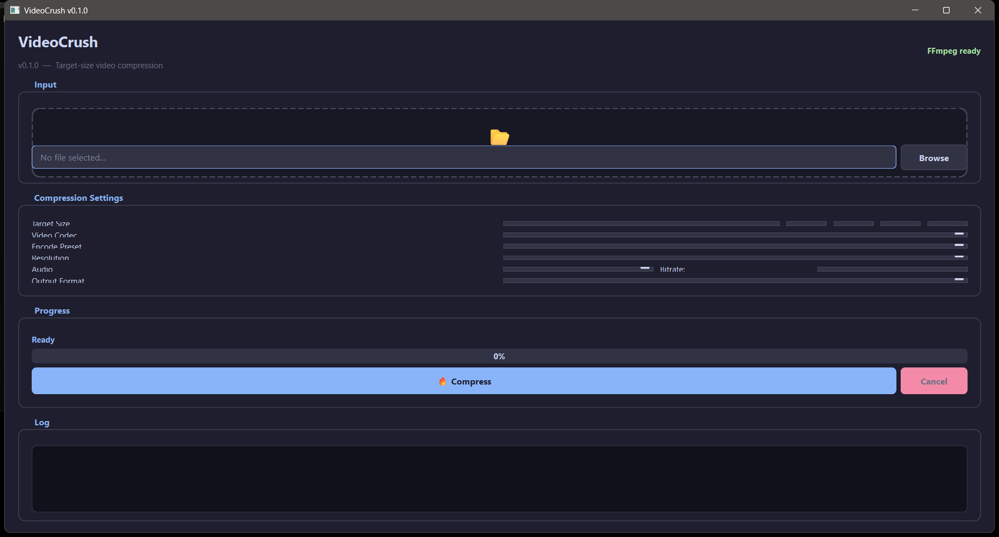

# VideoCrush v0.1.0

## Overview


## Tech Stack
Python, PyQt6 GUI

## Build / Run
```bash
pyinstaller --onefile --windowed main.py
```

## Key Files
- `video_compressor.py`

## Status
- Version: v0.1.0
- Files: ~5
