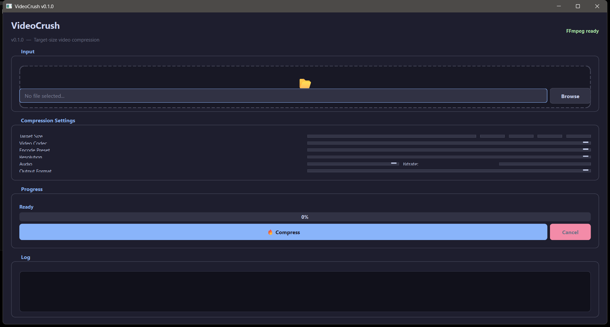

# VideoCrush



# VideoCrush


Python GUI video compressor with preset profiles, batch processing, and FFmpeg-powered encoding for optimal file size reduction.

## Features

- **Smart Compression** — Reduce video file sizes while preserving visual quality
- **Preset Profiles** — Quick presets for common use cases (web upload, email, archive)
- **Batch Processing** — Compress multiple videos in a queue
- **Format Support** — MP4, MKV, AVI, MOV, and other common formats
- **Quality Control** — Fine-tune CRF, bitrate, resolution, and codec settings
- **Quality Reports** — Persist before/after thumbnail strips with SSIM, VMAF, and size deltas
- **Media Utilities** — Create palette-optimized GIFs, detect scene changes, and optionally use Whisper/upscalers
- **Progress Tracking** — Real-time progress bar with size reduction estimates
- **Dark Theme** — Professional dark-themed interface

## Installation

```bash
python video_compressor.py
```

Dependencies auto-install on first run. Requires FFmpeg (auto-detected).

The same encoder is available without a GUI for automation:

```bash
python videocrush_cli.py --input ./in --preset web-1080p --out ./out --recursive
videocrush --input ./in --preset email-10mb --out ./out --recursive
videocrush --watch ./in --watch-rule .mov=web-1080p --out ./out
videocrush --export-presets ./videocrush-presets.json
videocrush --input ./clip.mp4 --out ./out --quality-report --scene-detect
videocrush --input ./clip.mp4 --gif-output ./clip.gif --gif-width 480
```

Use `--mode quality --crf 24` for quality-targeted output, `--dry-run` to
inspect the generated FFmpeg invocation, and `--export-script commands.bat`
to save a reproducible command script. The CLI accepts a file or folder and
can emit JSON results with `--json`.

Preset JSON files can be imported with `--import-presets`. The watch mode
routes extensions to profiles and supports `--watch-once` for scheduled runs.
On Windows, `--context-menu install` adds a current-user Explorer action and
`--schedule-name ... --schedule DAILY` prints a Task Scheduler command; add
`--register-schedule` to register it. `--after-queue sleep` or `shutdown` is
always explicit and opt-in. Optional media adapters cover URL capture through
yt-dlp, automatic Whisper subtitles, Real-ESRGAN/Video2X pre-passes, and
pngquant/jpegoptim/gifsicle image siblings when those tools are installed.

## Requirements

- Python 3.8+
- FFmpeg

For the optional installed `videocrush` command, install the project with
`pip install .`; the GUI dependency remains optional via `pip install .[gui]`.

## Related Tools

| Tool | Best For |
|------|----------|
| **VideoCrush** (this repo) | Compressing video files for smaller size — CRF, bitrate, and resolution controls |
| [MediaForge](https://github.com/SysAdminDoc/MediaForge) | Converting between formats — audio, video, and image transcoding |

## License

MIT License
